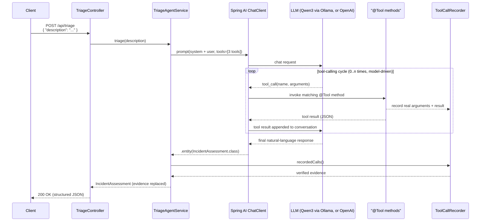
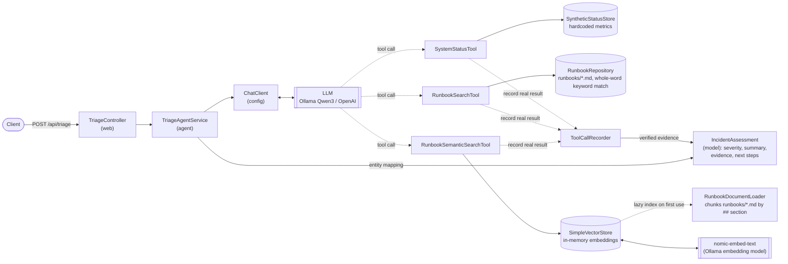
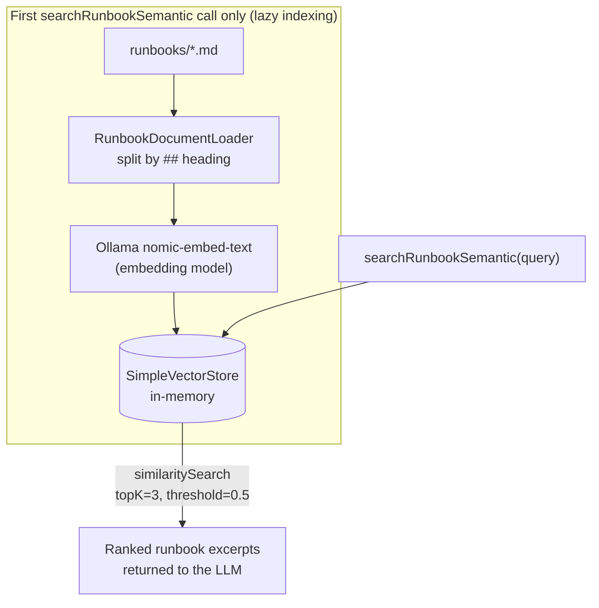
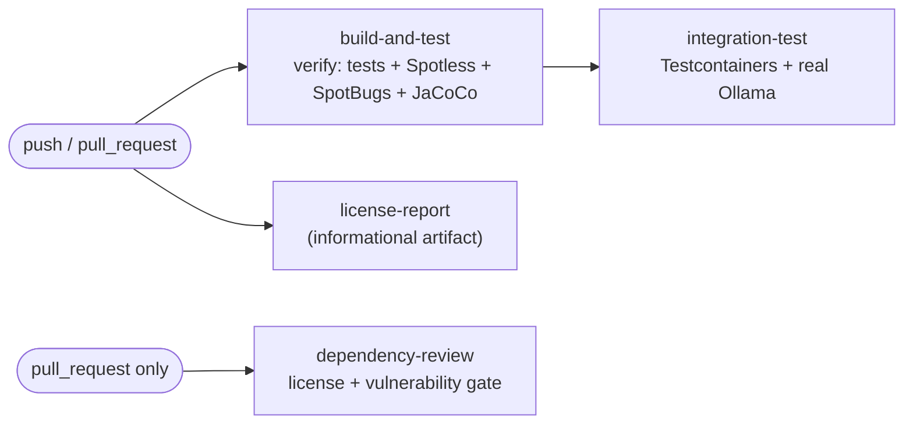

# incident-triage-agent

*A tool-calling AI agent lab, built with Spring AI*

**Java 25 | Spring Boot 4.1 | Spring AI 2.0 | Ollama (Qwen3, open-source) / OpenAI (optional)**

A lean, focused Spring Boot repository demonstrating **tool-calling AI agents** and
**structured outputs** using [Spring AI](https://spring.io/projects/spring-ai). It
evaluates AI agent patterns at the JVM level — how an LLM decides which Java methods to
call, how Spring AI orchestrates that loop, and how the final answer is deserialized
into a typed Java object — without over-engineering or making false claims about
production readiness.

## Contents

- [Purpose](#purpose)
- [Core Concepts](#core-concepts)
  - [Why an LLM needs tools](#why-an-llm-needs-tools)
  - [What "agent" means here](#what-agent-means-here)
  - [Why retrieval (RAG) instead of a bigger prompt](#why-retrieval-rag-instead-of-a-bigger-prompt)
  - [Retrieval as a tool: agentic RAG](#retrieval-as-a-tool-agentic-rag)
  - [Who does what: model, Spring AI, engine](#who-does-what-model-spring-ai-engine)
- [What It Does](#what-it-does)
  - [Why two search tools](#why-two-search-tools-a-worked-example)
  - [Evidence is recorded, not narrated](#evidence-is-recorded-not-narrated)
- [How It Works](#how-it-works)
- [Why Open-Source Models](#why-open-source-models)
- [Getting Started](#getting-started)
- [Configuration](#configuration)
- [Vector RAG (optional semantic search)](#vector-rag-optional-semantic-search)
- [Testing](#testing)
- [Continuous Integration](#continuous-integration)
- [Code Quality & Style](#code-quality--style)
- [Explicit Scope & Limitations](#explicit-scope--limitations)
- [Tech Stack](#tech-stack)
- [License](#license)

## Purpose

Most "AI demo" repositories either wrap a single prompt in a REST endpoint, or pull in
a full production stack (auth, persistence, vector databases, multi-agent frameworks)
that obscures the actual mechanics of tool-calling. This project deliberately sits in
between: **one real, end-to-end tool-calling agent**, built entirely on Spring AI's own
abstractions, with just enough surrounding structure (tests, CI, code quality gates,
license auditing) to look like production code — while being explicit about what is
*not* included (see [Explicit Scope & Limitations](#explicit-scope--limitations)).

It's meant to demonstrate, concretely and readably:

- How to expose plain Java methods as LLM-callable **`@Tool`**s with Spring AI.
- How **`ChatClient`** drives the request → tool-call → tool-result → response loop.
- How to get **strictly-typed structured output** (a Java record) back from a
  non-deterministic LLM response, instead of parsing free text.
- How **retrieval-augmented generation (RAG)** — even a minimal, in-memory one — fits
  alongside simpler keyword search, and when an agent might prefer one over the other.
- How to **keep an LLM honest about its own work**: the reported evidence is recorded
  from the tool calls that actually ran, not copied from the model's narrative.
- How to keep an AI-integrated Spring Boot service testable (fast unit tests with no
  network calls, plus an opt-in real-model integration test) and hooked up to a real
  CI pipeline (formatting, static analysis, coverage, license/vulnerability policy).

## Core Concepts

Short version of the ideas this repository exists to demonstrate. Skip ahead to
[What It Does](#what-it-does) if they're already familiar.

### Why an LLM needs tools

A language model's knowledge is frozen into its weights at training time, and it has no
network access of its own. It therefore cannot know whether `customer-api` is failing
*right now* — and, asked anyway, it will produce a confident, fluent, invented answer.

**Tools are the bridge to live and private state.** We give the model a menu of Java
methods it may call. It stops guessing about the error rate and instead asks for it. The
value isn't that the model gained a skill; it's that facts now enter the conversation
from a system of record rather than from the model's imagination.

### What "agent" means here

"Agent" is used loosely in the industry, so it's worth pinning down. In this project an
agent is exactly three things:

1. **A model with a goal**, given as a system prompt ("triage this incident").
2. **A set of tools it may use** to pursue that goal.
3. **A loop** that runs until the model decides it has enough to answer.

The defining property is *control flow moves into the model*. In ordinary code, Java
decides what happens next. Here the code hands over a menu and a goal, and the model
chooses the steps: check status first, then search runbooks, then search again with
different words, then stop. That sequence isn't in the source anywhere.

Equally important is what this agent deliberately is **not**:

| Not | Meaning |
|-----|---------|
| Not autonomous | It runs once, per HTTP request, and stops. Nothing runs in the background or on a schedule |
| Not stateful | No memory between requests; each triage starts from a clean conversation |
| Not multi-agent | One model, one loop. No planner/critic/worker roles handing off to each other |
| Not acting on the world | Every tool is read-only — it can look, and recommend, but never change anything |

That's the small, honest end of the agent spectrum, and it is where the interesting
mechanics actually live. Everything beyond it — planning, memory, autonomy, delegation —
is built on top of this same loop.

### Why retrieval (RAG) instead of a bigger prompt

Operational runbooks are internal documents: they were never in any public training set,
and they change. Three ways to get them in front of the model:

| Approach | Why not here |
|----------|--------------|
| Fine-tune the model on them | Expensive, slow to update, and stale the moment a runbook is edited |
| Paste every runbook into every prompt | Wastes context and money on every request, and degrades as the corpus grows past the context window |
| **Retrieve the few relevant passages, then prompt** | Cheap, always current, scales with the corpus — this is **RAG** |

Retrieval-Augmented Generation just means: *find the small slice of your documents that
matters for this question, and put only that in the context.* The reasoning stays with
the model; the facts come from your corpus. Here that's deliberately minimal — three
markdown files, an in-memory vector store — because the pattern, not the scale, is the
point.

### Retrieval as a tool: agentic RAG

Textbook RAG is a fixed pipeline: **every** request is embedded, searched, and the hits
are stapled into the prompt before the model ever runs. The model has no say in it.

This project instead exposes retrieval **as a tool the model may call**:

- It can skip retrieval entirely when the incident needs no runbook.
- It chooses the search query itself — usually a distilled version of the user's text,
  not the raw description.
- It can search more than once, or switch to the other search tool, if the first result
  looks irrelevant.

That's the difference between a *retrieval pipeline* and an *agent that can look things
up*. The trade-off is honest: pipeline RAG is predictable and always retrieves; agentic
RAG is adaptive but depends on the model choosing well, which is exactly why the
[worked example](#why-two-search-tools-a-worked-example) and the recorded
[evidence trail](#evidence-is-recorded-not-narrated) matter.

### Who does what: model, Spring AI, engine

The most common misconception about tool calling is that the model executes something.
**It does not.** It only emits a structured request; everything else is ordinary Java.

| Layer | Responsibility |
|-------|----------------|
| **Engine** (Ollama / OpenAI) | Hosts and runs the model; must support the tool-calling API. Serves two distinct models here: a *chat* model that reasons, and an *embedding* model that turns text into vectors |
| **Model** (Qwen3, GPT-4o-mini, …) | Decides *whether*, *which* and *how many times* to call a tool, and with what arguments. Emits that as structured JSON — and nothing more |
| **Spring AI** (`ChatClient`) | Advertises the `@Tool` methods and their generated JSON schemas to the model, parses the model's tool request, binds JSON arguments to Java parameters, invokes the bean method, serializes the return value back into the conversation, and repeats until the model stops asking. Finally maps the closing message onto a Java record |
| **Your Java code** | The tool bodies and the surrounding service. Plain methods with an annotation — no prompt parsing, no HTTP plumbing, no loop management |

So the "agent loop" everyone talks about is, concretely, that Spring AI middle row. This
repository exists to show it working on real code, and to be explicit about which parts
are the framework's and which are yours.

## What It Does

The single use case is **incident triage**. You POST a free-text description of a
simulated production problem; the agent investigates it using the tools available to
it, then returns a structured assessment for a human to review.

### API contract

| | |
|---|---|
| **Endpoint** | `POST /api/triage` |
| **Request body** | `{"description": "<free-text incident description>"}` |
| **Success** | `200 OK` with an `IncidentAssessment` JSON body |
| **Validation error** | `400 Bad Request` if `description` is missing or blank |

### The three tools the model can call

| Tool | Kind | What it returns |
|------|------|-----------------|
| `getSystemStatus(service)` | Synthetic metrics lookup | Health flag, error rate, p95 latency and active alerts for one service |
| `searchRunbook(query)` | Lexical keyword match | Up to 3 runbook *sections*, ranked by how many distinct query keywords they contain |
| `searchRunbookSemantic(query)` | Embedding similarity (RAG) | Up to 3 runbook *sections* whose meaning is closest to the query |

Both search tools index **the same runbooks split into the same `##` sections**, so the
only thing that differs is the retrieval strategy — which is what makes comparing them
meaningful.

The model decides **whether**, **which**, and **how many times** to call these — the
Java code never hard-codes that decision (see
[Who does what](#who-does-what-model-spring-ai-engine)). In practice it usually calls
`getSystemStatus` to confirm the symptom, then one or both search tools to find
remediation guidance.

#### Why two search tools: a worked example

The keyword tool matches whole words only, after discarding stop words. That makes it
precise when the wording lines up, and blind when it doesn't:

| Query | `searchRunbook` finds | `searchRunbookSemantic` finds |
|-------|----------------------|-------------------------------|
| `"customer-api returning 5xx errors"` | `5xx-errors.md` — exact hits on `customer-api`, `5xx`, `errors` | the same runbook |
| `"customers cannot log in"` | the **wrong** runbook: `5xx-errors.md`, purely because it contains the word "customers" | `auth-failures.md`, the right one |

The second row is the whole point. `auth-failures.md` never uses the words "log in" or
"customers" — it talks about `401/403`, tokens, and signing keys. Lexical search cannot
bridge that gap; embeddings can. Giving the model both tools lets it retry semantically
when a keyword lookup returns something implausible.

### Bundled mock data

There is no real infrastructure behind this, so both data sources are fixed and local:

**Synthetic services** known to `getSystemStatus`. Any other name returns a healthy
placeholder carrying a `NoDataAvailable:unknownService` alert:

| Service | Healthy | Error rate | p95 latency | Active alerts |
|---------|:-------:|-----------:|------------:|---------------|
| `customer-api` | no | 47.5 % | 3200 ms | `HighErrorRate:5xx`, `LatencyBudgetBurn` |
| `auth-service` | no | 12.0 % | 950 ms | `ElevatedLatency` |
| `payment-service` | yes | 0.2 % | 180 ms | — |
| `notification-service` | yes | 0.0 % | 90 ms | — |

**Runbooks** searched by both retrieval tools, in `src/main/resources/runbooks/`:
`5xx-errors.md`, `auth-failures.md` and `latency.md`. Each is structured as
`## Symptoms` / `## Likely Causes` / `## Recommended Actions` — headings the semantic
tool uses as chunk boundaries.

### The structured response

The model's final response is mapped onto the `IncidentAssessment` record rather than
being returned as arbitrary prose. A tool-calling model that can produce the requested
schema is therefore essential (see [Configuration](#configuration)):

| Field | Type | Meaning | Source |
|-------|------|---------|--------|
| `severity` | enum: `LOW`, `MEDIUM`, `HIGH`, `CRITICAL` | Overall severity classification | model |
| `incidentSummary` | `String` | Concise restatement of what is happening | model |
| `evidence` | `List<String>` | What the tools actually returned | **recorded, not model-authored** |
| `recommendedNextSteps` | `List<String>` | Suggested investigation/remediation actions | model |

#### Evidence is recorded, not narrated

An LLM asked to report "the evidence you gathered" will happily write plausible facts it
never obtained. So `evidence` is **not** taken from the model at all: every `@Tool`
invocation records its real arguments and real result (`ToolCallRecorder`), and the
agent substitutes that recorded trail into the response before returning it.

This gives a reader something to check the model against: if the summary says the
database is gone but the evidence shows only `getSystemStatus(customer-api) -> healthy=false`,
the model overreached. It's a small, concrete answer to "how do you keep an LLM
accountable?" — and it's what the [Human-in-the-Loop](#explicit-scope--limitations)
caveat rests on.

#### Severity is defined, not guessed

The system prompt gives the model an explicit rubric instead of leaving `HIGH` versus
`CRITICAL` to its mood. `Severity`'s Javadoc documents the same thresholds:

| Severity | Rubric given to the model |
|----------|---------------------------|
| `CRITICAL` | Service down or unusable for most users; error rate above 25% |
| `HIGH` | Major degradation with clear user impact; 5–25% errors, or an active error-rate alert |
| `MEDIUM` | Noticeable but contained; 1–5% errors, or elevated latency without widespread failure |
| `LOW` | Little or no user impact; healthy metrics or an informational report |

Output remains non-deterministic, but it is now non-deterministic *against a stated
scale* — so a surprising severity is a reviewable disagreement rather than noise.

## How It Works

### Request flow: from HTTP request to structured assessment



Every arrow between `ChatClient` and `Tools` is Spring AI's work, not the model's: the
model only ever emits a tool *request*, and Spring AI resolves, invokes and feeds back
the result until the model stops asking.

### Component overview



Package responsibilities (base package `eu.volsch.lab`):

| Package  | Responsibility                                                            |
|----------|----------------------------------------------------------------------------|
| `web`    | HTTP boundary: `TriageController`, request DTO validation                  |
| `agent`  | Orchestration: builds the system prompt, registers tools, drives the `ChatClient` call, maps the result |
| `tool`   | The three `@Tool`-annotated capabilities the LLM can invoke, their backing data/logic, and the `ToolCallRecorder` that captures what they really returned |
| `model`  | Plain, immutable data carriers (records/enums) shared across layers        |
| `config` | Spring `@Configuration`: `ChatClient` provider wiring (Ollama vs. OpenAI), `VectorStore` bean |

## Why Open-Source Models

After the initial model downloads, the default setup uses **Qwen3:14b** (Apache 2.0
licensed) through a local Ollama server — no API key, per-token cost, or cloud-model
dependency. An OpenAI profile is included purely to demonstrate Spring AI's
model-agnostic `ChatClient` abstraction; it is **not** required to run the project.

## Getting Started

### Prerequisites

- **Java 25** (the Maven wrapper `./mvnw` handles Maven itself)
- **[Ollama](https://ollama.com)**, installed and running locally:

  ```bash
  # macOS
  brew install ollama          # or download the app from https://ollama.com/download

  # Linux
  curl -fsSL https://ollama.com/install.sh | sh

  # Windows: run the installer from https://ollama.com/download
  ```

  The macOS app and the Linux installer's systemd service start the server for you. If
  you installed via Homebrew without the app, start it yourself with `ollama serve`.
  Verify it's up — this should return JSON, not a connection error:

  ```bash
  curl http://localhost:11434/api/tags
  ```

- **The chat and embedding models pulled** (~9 GB and ~275 MB respectively, downloaded
  once and then cached):

  ```bash
  ollama pull qwen3:14b
  ollama pull nomic-embed-text
  ```

  Short on RAM/VRAM? See [Configuration](#configuration) for a smaller chat model.

### Run

```bash
./mvnw spring-boot:run
```

### Try it

```bash
curl -X POST http://localhost:8080/api/triage \
  -H "Content-Type: application/json" \
  -d '{"description": "customer-api returning 5xx errors for the past 10 minutes"}'
```

Example response shape. Note that `evidence` shows the recorded tool calls verbatim, so
it reflects what really happened rather than what the model says happened:

```json
{
  "severity": "HIGH",
  "incidentSummary": "customer-api is unhealthy with a severely elevated 5xx error rate and p95 latency far above budget.",
  "evidence": [
    "getSystemStatus(customer-api) -> healthy=false, errorRatePct=47.5, latencyMs=3200, activeAlerts=[HighErrorRate:5xx, LatencyBudgetBurn]",
    "searchRunbook(customer-api 5xx errors) -> [5xx-errors.md] ## Recommended Actions 1. Check active alerts and error rate via system status..."
  ],
  "recommendedNextSteps": [
    "Check recent deployments to customer-api and roll back if a bad release correlates with the onset",
    "Inspect database connection pool saturation and payment-service dependency health"
  ]
}
```

The `incidentSummary` and `recommendedNextSteps` wording varies between runs; the schema
and the evidence trail do not.

## Configuration

Every model setting is environment-overridable (see
`src/main/resources/application.yml`), so nothing needs recompiling to point the app at
a different server or model:

| Variable | Default | Purpose |
|----------|---------|---------|
| `OLLAMA_BASE_URL` | `http://localhost:11434` | Address of the Ollama server |
| `OLLAMA_MODEL` | `qwen3:14b` | Chat model that drives the agent |
| `OLLAMA_EMBEDDING_MODEL` | `nomic-embed-text` | Embedding model for semantic runbook search |
| `OPENAI_API_KEY` | *(empty)* | Only needed with the `openai` profile |
| `OPENAI_MODEL` | `gpt-4o-mini` | Only used with the `openai` profile |

If `qwen3:14b` is too heavy for your machine (it needs roughly 9 GB of RAM/VRAM), use
a smaller Ollama model that supports tool calling:

```bash
ollama pull qwen3:8b
OLLAMA_MODEL=qwen3:8b ./mvnw spring-boot:run
```

> **The model must support tool calling.** Models without it will answer in prose
> instead of invoking the tools, and structured-output mapping becomes unreliable.

### Using OpenAI instead

The `openai` profile swaps the chat provider without touching a line of application
code — `TriageAgentService` only ever sees Spring AI's `ChatClient` abstraction:

```bash
export OPENAI_API_KEY=sk-...
./mvnw spring-boot:run -Dspring-boot.run.profiles=openai
```

Embeddings for semantic search still come from Ollama in this profile. A local Ollama
server with `nomic-embed-text` therefore remains required whenever the model chooses to
call `searchRunbookSemantic`.

## Vector RAG (optional semantic search)

Alongside the default keyword-based `searchRunbook` tool, a second tool,
`searchRunbookSemantic`, demonstrates a minimal **Retrieval-Augmented Generation (RAG)**
pattern using Spring AI's `VectorStore`/`EmbeddingModel` abstractions. For *why*
retrieval is used at all, and why it is exposed as a tool rather than as a fixed
pre-prompt pipeline, see [Core Concepts](#core-concepts).



- Runbook markdown files are split into per-section chunks (`RunbookDocumentLoader`) and
  embedded with Ollama's `nomic-embed-text` model. The keyword tool splits the same files
  into the same sections, so both tools compete on equal terms.
- Chunks are held in an in-memory `SimpleVectorStore` — no external vector database — and
  indexed **lazily** on first use, so plain application/context startup (including unit
  tests) never triggers a network call to the embedding model.
- The LLM agent can call either tool: `searchRunbook` when the incident wording matches
  the runbooks' own vocabulary, or `searchRunbookSemantic` when it doesn't — see the
  [worked example](#why-two-search-tools-a-worked-example) of a query where lexical
  search picks the wrong runbook and semantic search picks the right one.

This is intentionally kept alongside (not replacing) the simpler keyword search. Keyword
search is cheaper, needs no model, and is easier to explain when it hits; semantic search
costs an embedding round-trip but survives vocabulary mismatch. Showing both — and where
each fails — is more honest than declaring one the winner.

## Testing

| Suite | Command | Requires |
|-------|---------|----------|
| Fast unit & slice tests (default) | `./mvnw test` | nothing — no network, no model |
| Docker-based integration test | `./mvnw test -Pintegration-test` | a running Docker daemon |

The fast suite runs fully offline in seconds: agent tests mock `ChatClient`, and lazy
semantic indexing ensures context and tool tests never call a model. It is the suite
measured by the coverage gate.

The opt-in integration test (`TriageAgentIntegrationTest`) spins up a real Ollama server
in a Docker container via [Testcontainers](https://testcontainers.com), pulls a small
open-source chat model (`qwen2.5:1.5b`) plus the `nomic-embed-text` embedding model, and
exercises the full tool-calling + structured-output loop end-to-end — including the
semantic search tool — with no mocks. It's tagged `integration` and therefore excluded
from the default `./mvnw test` run, because it needs Docker and takes noticeably longer
(image and model pulls).

## Continuous Integration

A GitHub Actions workflow (`.github/workflows/build-and-test.yml`) runs on pushes to
`main`, on every pull request, and on manual dispatch:

1. **`build-and-test`** — sets up JDK 25 and runs `./mvnw verify`: compiles, runs all
   fast unit/slice tests, and enforces the Spotless, SpotBugs, and JaCoCo coverage
   quality gates. The JaCoCo HTML report is uploaded as a build artifact.
2. **`integration-test`** (depends on job 1) — runs on a GitHub-hosted Ubuntu runner
   (Docker is preinstalled, so no extra setup is needed for Testcontainers) and
   executes `./mvnw test -Pintegration-test`: spins up a real Ollama container, pulls
   `qwen2.5:1.5b` and `nomic-embed-text`, and exercises the full tool-calling +
   structured-output + semantic-search loop end-to-end.
3. **`license-report`** (runs independently, in parallel) — generates a human-readable
   dependency license report (`./mvnw license:aggregate-third-party-report`) and
   uploads it as a build artifact. Informational only; does not fail the build.
4. **`dependency-review`** (pull requests only) — runs GitHub's official
   [`actions/dependency-review-action`](https://github.com/actions/dependency-review-action),
   which **fails the PR** if a newly introduced dependency carries a license outside an
   explicit allow-list (Apache/MIT/BSD/EPL/CDDL/LGPL/etc.), or a high/critical severity
   known vulnerability — see [License](#license).



All jobs except `dependency-review` (which needs a pull-request diff) can also be
triggered manually via `workflow_dispatch`. The integration job has a 20-minute timeout
to accommodate the model pulls on a cold cache. All third-party GitHub Actions used
(`actions/checkout`, `actions/setup-java`, `actions/upload-artifact`,
`actions/dependency-review-action`) are pinned to their latest major versions.

## Code Quality & Style

- **Formatting:** Google Java Format, enforced via Spotless (`./mvnw spotless:apply` to
  auto-fix, `./mvnw spotless:check` — part of `verify` — to check).
- **Static analysis:** SpotBugs (`./mvnw verify` runs it at `effort=Max`,
  `threshold=Medium`). Justified suppressions live in `spotbugs-exclude.xml`.
- **Code coverage:** JaCoCo, enforced at **80% minimum** instruction and branch
  coverage (`./mvnw verify` runs the `jacoco-check` goal; currently ~98%
  instruction / ~95% branch). Trivial, not-meaningfully-unit-testable code is
  excluded from the measured bundle: the `@SpringBootApplication` bootstrap class,
  `@Configuration` bean-wiring classes (exercised via context-loading tests instead),
  and plain data-carrier records/enums (`model` package, `TriageRequest`). HTML report:
  `target/site/jacoco/index.html` (open after running `./mvnw verify` or `./mvnw test`).
- **Javadoc:** all public API, constructors, and non-trivial private/package-private
  methods are documented.
- Run the full local quality gate with:
  ```bash
  ./mvnw verify
  ```

## Explicit Scope & Limitations

This repository intentionally isolates Spring AI, `@Tool` method binding, agent
orchestration, and structured JSON outputs. **It is not a production-ready operations
tool.**

- **Mock Data Only**: System status and runbook tools rely on hardcoded synthetic data
  and local files; no real cloud or APM connections.
- **Read-Only**: The agent cannot perform writing or corrective infrastructure actions.
- **Basic Lexical Search**: `searchRunbook` filters stop words and matches whole words,
  but does no stemming, synonym expansion or fuzzy matching — "latencies" will not match
  "latency". That gap is deliberate: it is exactly what the semantic tool exists to show.
- **No Enterprise Boilerplate**: Omits authentication, database persistence,
  multi-tenancy, scaling, and fault-tolerance patterns.
- **Minimal RAG, No External Vector Database**: The optional semantic search tool uses
  an in-memory `SimpleVectorStore`, not a production vector database, and there is no
  document-ingestion pipeline beyond the bundled runbooks. It illustrates the RAG
  pattern, not a production-grade retrieval system.
- **Human-in-the-Loop**: Severity, summary and next steps are non-deterministic model
  output and are advisory only. The `evidence` field is the exception — it is recorded
  from real tool calls, so it can be used to check the rest of the response.


## Tech Stack

| Layer | Choice |
|-------|--------|
| Language | Java 25 |
| Framework | Spring Boot 4.1 |
| AI | Spring AI 2.0 (`ChatClient`, `@Tool`, `VectorStore`, structured output) |
| Default model | Qwen3:14b via Ollama — open-source, local, no API key |
| Embeddings | `nomic-embed-text` via Ollama, into an in-memory `SimpleVectorStore` |
| Optional model | OpenAI (via the `openai` profile) |
| Build | Maven (`./mvnw`) |
| Testing | JUnit 5, Mockito, AssertJ, Testcontainers (Ollama module) |
| Quality gates | Spotless (Google Java Format), SpotBugs, JaCoCo (80% minimum) |
| CI | GitHub Actions, incl. `actions/dependency-review-action` license/CVE policy |

## License

This project is licensed under the [Apache License, Version 2.0](LICENSE).
Copyright 2026 Volker Schmidt.

All code, documentation, diagrams and the sample runbooks in this repository are
original work. Trademark attributions and third-party notices are collected in
[NOTICE](NOTICE) — in short, this is an independent, unofficial learning example, and
names such as Spring, Java, OpenAI, Qwen and Docker are used only to identify the
technologies it integrates with.

### Third-party dependencies

Dependency licenses can be audited at any time via:

```bash
./mvnw license:aggregate-third-party-report
# report written to target/reports/aggregate-third-party-report.html
```

As of the last audit, all 176 declared dependencies use permissive licenses (Apache
2.0, MIT, BSD, EPL, or dual-licensed EPL/LGPL frameworks used only via dynamic linking,
or GPL with a Classpath Exception) — no copyleft (GPL/AGPL-only) dependencies are
present.

License policy is enforced automatically on every pull request by the
`dependency-review` CI job, using GitHub's official
[`actions/dependency-review-action`](https://github.com/actions/dependency-review-action)
against an explicit license allow-list — see [Continuous
Integration](#continuous-integration). Unlike a custom Maven-report parser, this uses
GitHub's own dependency graph and vulnerability advisory database, so it also catches
known-vulnerable dependencies, not just license issues.
